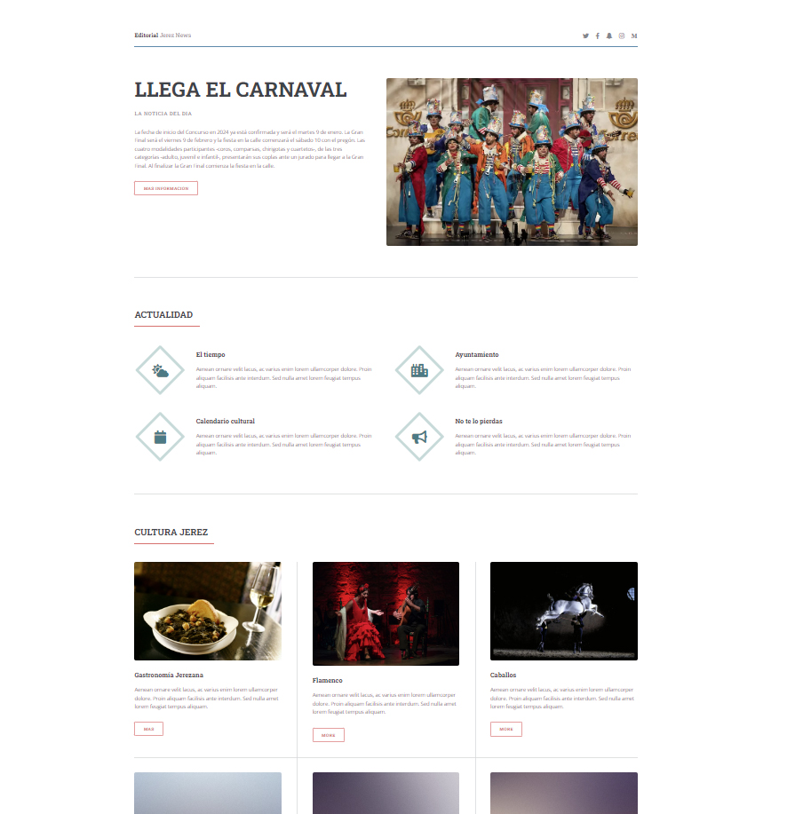
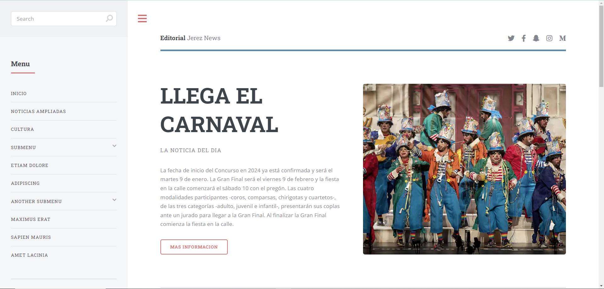

# Ejercicio del Certificado Profesional

Ejercicio que consiste en modificar una plantilla a mi gusto, con el contenido que yo elija, estilo, imágenes, texto, etc. Utilizando HTML y CSS.
En el proceso de aprendizaje haciamos varios ejercicios prácticos para aprender a fondo HTML, CSS y JavaScript y luego pasabamos a hacer evaluaciones prácticas y cuestionarios con preguntas, tanto de las unidades de aprendizaje como del módulko en cuestión.Comparto varias en mi GitHub.

## Captura de Pantalla

## Ver ejemplo en vivo
[ https://isaan86.github.io/EjercicioConPlantilla/]( https://isaan86.github.io/EjercicioConPlantilla/)

## Tecnologías Utilizadas

- HTML5
- CSS3

## Creditos

	Template:
		Editorial by HTML5 UP
		html5up.net | @ajlkn

	Demo Images:
		Unsplash (unsplash.com)

	Icons:
		Font Awesome (fontawesome.io)

	Other:
		jQuery (jquery.com)
		Responsive Tools (github.com/ajlkn/responsive-tools)

## Contacto

Para cualquier pregunta o comentario, no dudes en contactarme:

- Nombre: Alexandra Ferrera Arenas
- Perfil de Linkedin: https://www.linkedin.com/in/alexandra-ferrera-arenas/
- Correo Electrónico: sandraferreraarenas@gmail.com